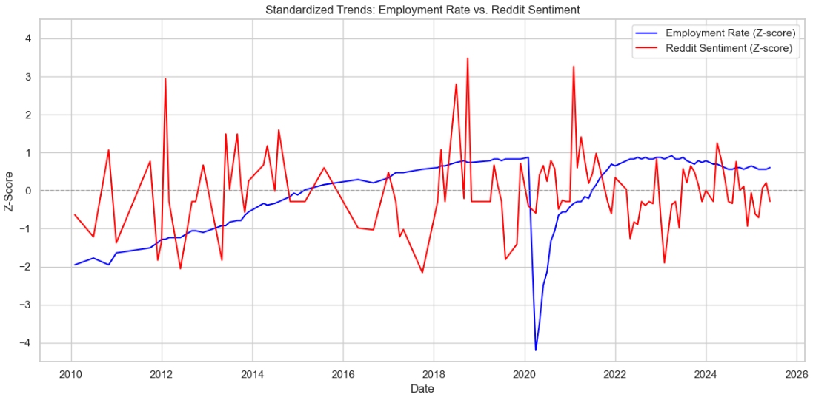
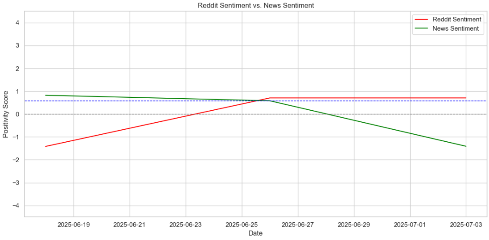

# Reddit-News Economy Analysis
This program investigates correlation among Federal Reserve Economic Data (FRED) and headlines from news sites and Reddit posts. The Federal Reserve Bank of St. Louis, Reddit, and newsapi.org all provide APIs for freely accessing their data. The St. Louis bank API gives employment data across time. The Reddit API provides posts discussing unemployment from the subreddit, r/Economics. News API similarly gathers news headlines about unemployment. Using the VaderSentiment library, a "sentiment" score is given to each Reddit post and news title. This score basically classifies each headline as a positive or negative message.

With this data, two correlations are investigated. One would expect that the sentiment of unemployment posts would rise and fall with the employment rate. However, the graph below shows no visible correlation, and calculating the Pearson correlation score, -0.0467, confirms this.

The second correlation is between news headlines and the posts on r/Economics. These would likely be correlated. Unfortunately, there were only three available data points to draw the correlation from, so the result is inconclusive. Nonetheless, the graph is shown below.

